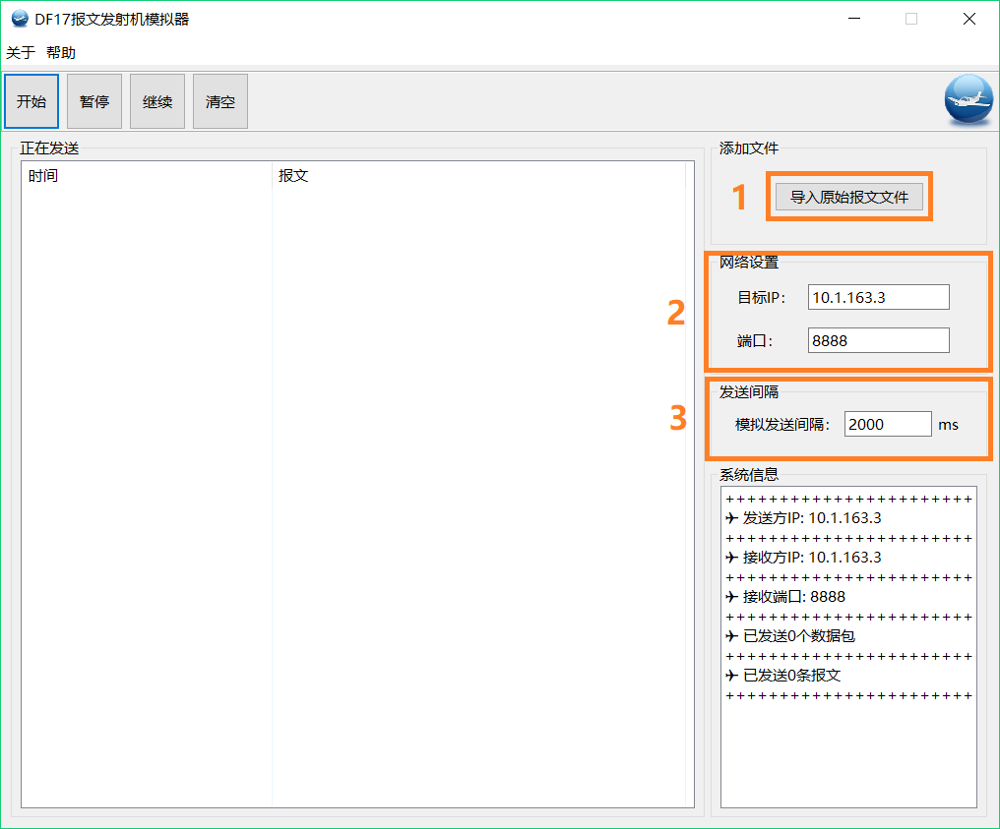
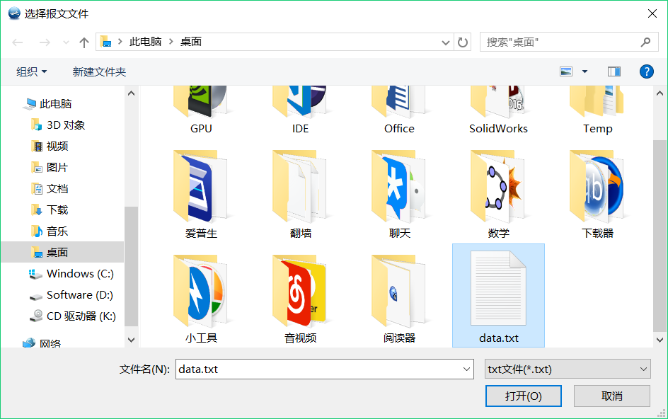
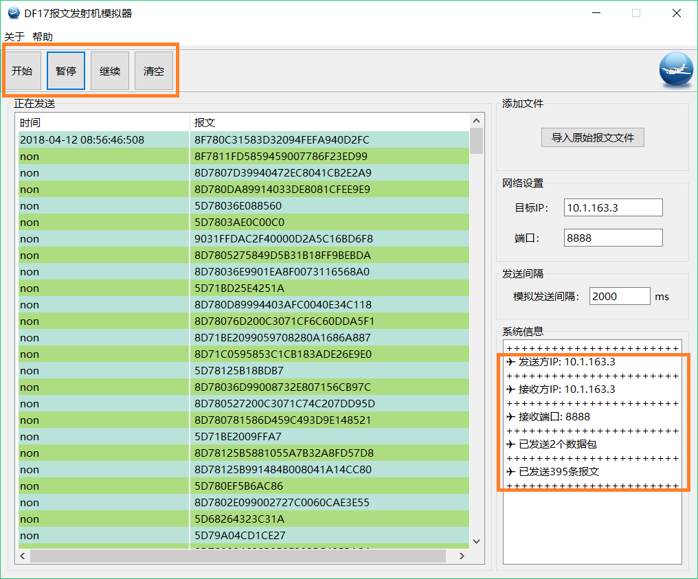
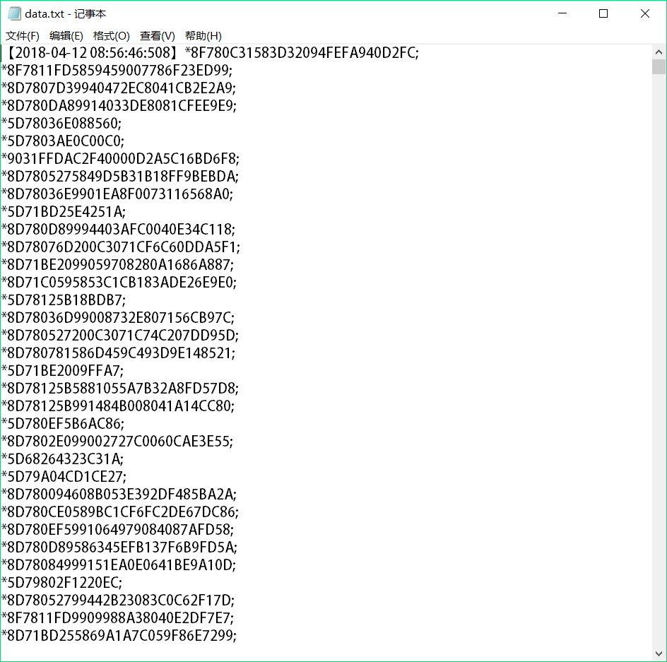

# 报文模拟发射器

### 开发环境

* *JDK:* SE1.8
* *界面制作工具:* SWT

### 源文件结构

    src--|
         |--ui--|
         |      |--UI.java
         |
         |--util--|
         |        |--BufferReader.java
         |        |--Filter.java
         |
         |--sender--|
         |          |--UDPSender.java
         |          |--Task.java
         |
         |--img--|
         |       |--icon1.ico
         |       |--icon2.ico
         |
         |--org.eclipse.wb.swt

* <font color=#4682B4 size=4 face="微软雅黑">*ui*</font>

| 源文件  | 类 | 描述        |
| ------ |----| ------------|
| UI     | UI | 图形用户界面 |

* <font color=#4682B4 size=4 face="微软雅黑">*util*</font>

| 源文件         | 类            |  描述                     |
|---------------|---------------|---------------------------|
| BufferReader  | BufferReader  |   有缓冲的文件读入流，可以得到文件中指定的行和统计文件中的行数   |
| Filter        | Filter        |   行过滤，将读入的行分解为时间项和报文项   |

* <font color=#4682B4 size=4 face="微软雅黑">*sender*</font>

| 源文件         | 类            |  描述                     |
|---------------|---------------|---------------------------|
| UDPSender     |  UDPSender    |  发射报文，设置了定时器Timer，定时发送数据包  |
| Task          |  Task         |  定时器Timer执行的具体发射任务  |

* <font color=#4682B4 size=4 face="微软雅黑">*img*</font>

用户界面上的一些图标，系统内部资源

* <font color=#4682B4 size=4 face="微软雅黑">*org.eclipse.wb.swt*</font>

界面制作工具 SWT 的管理文件

### 使用方法

<font color=#4682B4 size=4 face="微软雅黑">**1. 选择`导入原始报文文件`按钮，会出现一个文件目录对话框，需要选择正确的报文文件点击`打开`。报文文件的格式在[注意事项](#jump)中有说明。并且需要填入目标IP地址和端口，选择模拟发送间隔，这里的模拟发送间隔是每隔多少秒发送一个数据包。**</font>

{:width="600px"}

{:width="600px"}

<font color=#4682B4 size=4 face="微软雅黑">**2. 点击`开始`按钮以开始报文发送任务，`暂停`按钮用于暂停发射，`继续`按钮用于继续发射，`清空`按钮用于清空列表。正在发送窗口中的表格每500条更新一次。在系统信息显示列表中可以显示本机IP和目标IP以及端口，并可以显示已发送的数据包数量和报文数量。**</font>

{:width="600px"}

### <span id="jump">注意事项</span>

报文文件的结构如下图所示，必须具有这样的结构。

{:width="600px"}

报文之间可以有空行，每条报文前必须有`*`，结尾必须有`;`，时间标记必须用`【】`括起来，时间标记和报文可以不在同一行内。

可以接受的报文格式：
```
【2018-04-12 08:56:46:508】*8F780C31583D32094FEFA940D2FC;
*8F7811FD5859459007786F23ED99;
*8D7807D39940472EC8041CB2E2A9;
*8D780DA89914033DE8081CFEE9E9;
*5D78036E088560;
*5D7803AE0C00C0;
*9031FFDAC2F40000D2A5C16BD6F8;
*8D7805275849D5B31B18FF9BEBDA;
*5D7802E001DA61;
*8D780FCE9940CC1A48600E72EB0F;
*8F780C31990D3F0CB0480C7A7555;

【2018-04-12 08:56:46:914】*8D7808C8994001B5E80813BE2E25;
*8D780C9F588F720E75B8AC8F5227;
*9031FFDAC114D0A034978E4CB7D5;
*9031FFDAC21400000DE1B95D25B3;
*8D7810FC5837F1E3F7DA7FF6F0B7;
【2018-04-12 08:56:47:128】A877053;
*5D780D4A5D3DE6;
*8F7811FD251C34B7E77DE07B9479;
*8F780C31F82300060049B83766F5;
```


